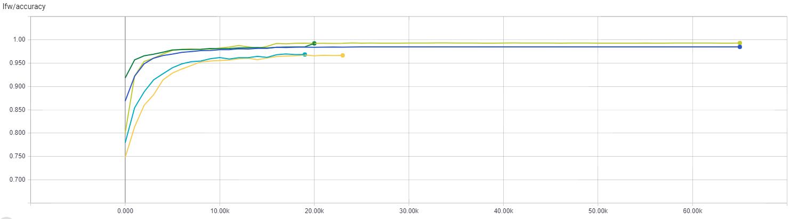

# Additive-Margin-Softmax
This is the implementation of paper &lt;Additive Margin Softmax for Face Verification>

Training logic is not provide here, it is highly inspired by Sandberg's [Facenet](https://github.com/davidsandberg/facenet), check it if you are interested.

Instead, 
**model structure** can be found at **resface.py** 
and 
**loss head** can be found at **AM-softmax.py**

## lfw accuracy

### 2018-2-11
Currently it only reaches 97.6%. There might be some bugs, or some irregular preprocessings, when it reaches > 99%, detail configuration will be posted here.

### 2018-2-14
Now acc on lfw reaches 99.3% with only use resface36 and flipped-concatenate validation. Validation curve will be updated here lately.

